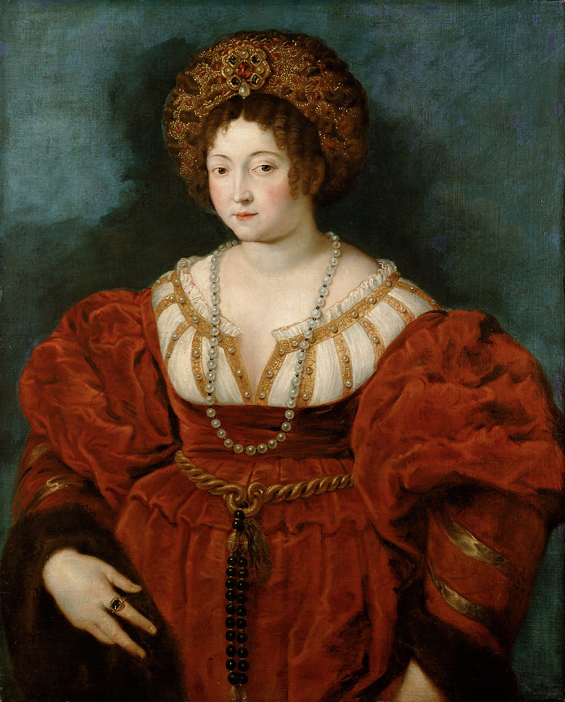
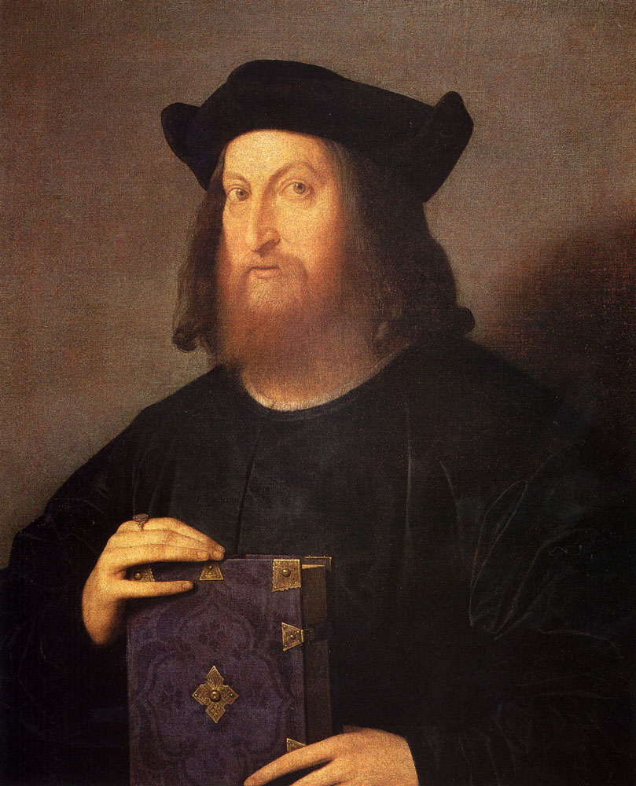
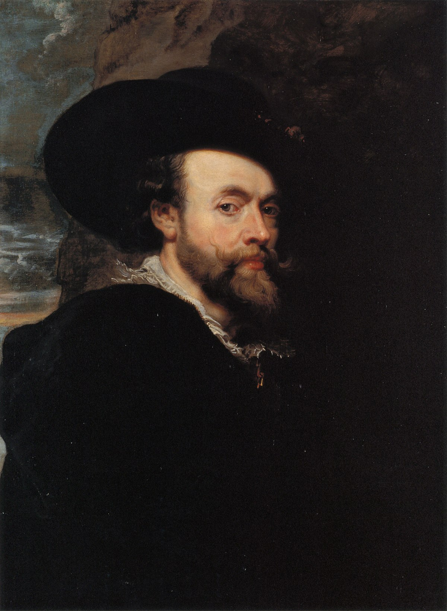
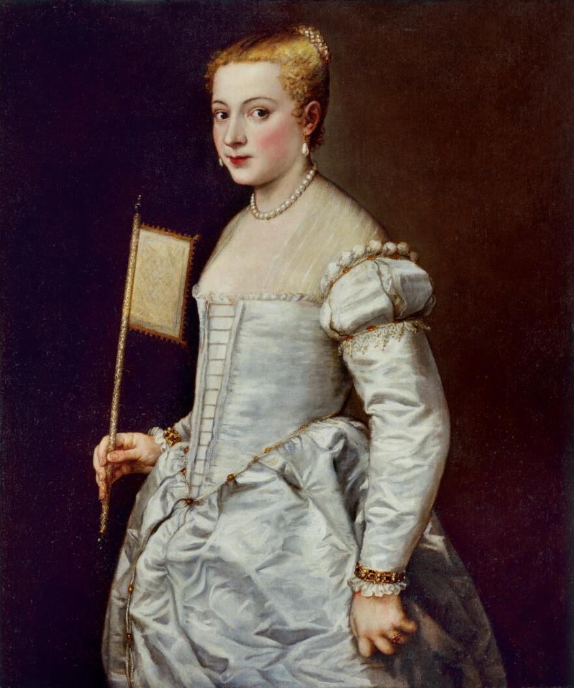
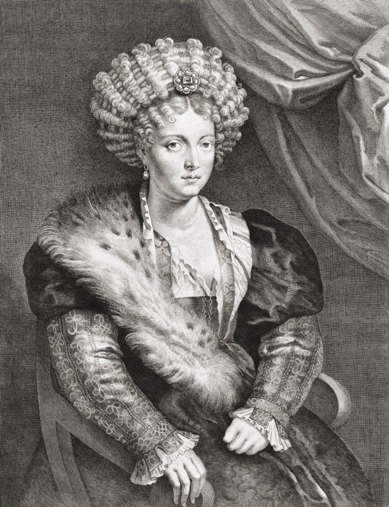
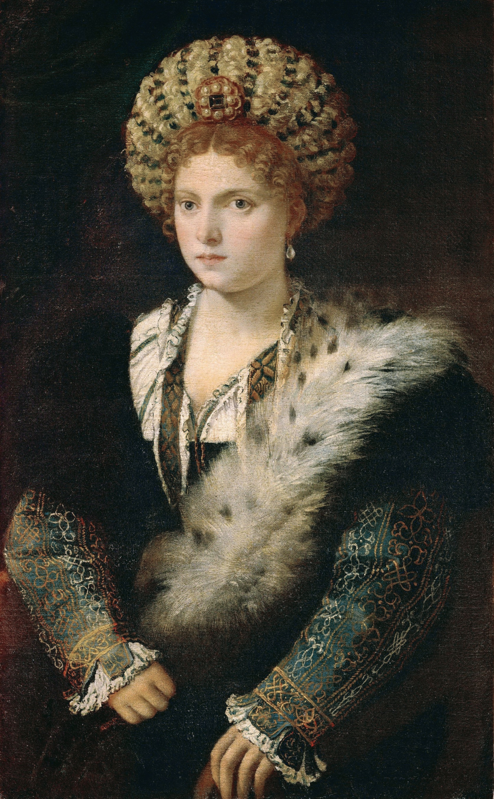
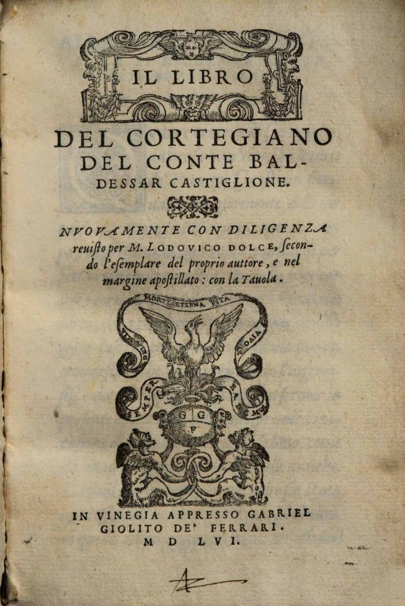
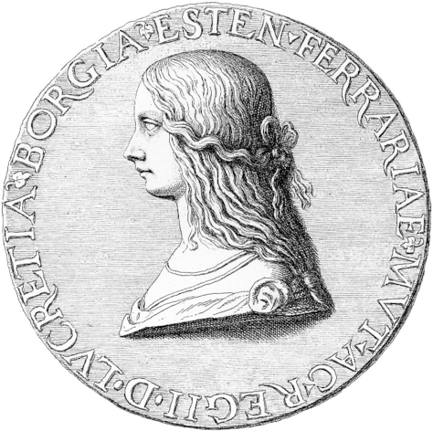

# Rubens und "die Quelle  und Ursprung all der  schönen Moden in Italien".  Das Porträt von Isabella D'Este.
_
Ein Text von Dr. Sara Van Dijk
_

<a href="https://www.digitale-sammlungen.de/de/view/bsb11283404?page=5)" target="_blank" style="text-align: center; display:block; line-height:1.3" >Porträt von Isabella D'Este in Rot, Peter Paul Rubens nach Tizian, ca. 1605 , Öl auf Leinwand,
101,8 × 81 cm, Kunsthistorisches Museum Wien, Inv.-Nr: GG_1534 </a>

---
#
_
„She, Macro said, had her hair spread over her head in such  a way that it ran off her lovely and **delicate shoulders**; and it was gathered in a **hairnet of auburn silk**, which had been worked with such skillful craftsmanship that to me the knots seemed to be of the **finest gold**, and through the mesh of this hairnet, which was rather large, you could see her locks of **hair shining almost like sunbeams** that sparkled everywhere. In the middle of her forehead, where the hair is parted, she had a very beautiful and **glowing ruby**, from which a shiny and **large pearl** was dangling; and around her neck she had a string of very large and splendid pearls, which hung down from one side and the other of her chest almost to her belt; she wore a **beautiful and rich dress** of black velvet, loaded with very well-placed gold buckles, and everything she had on her was so **admirably decorated** that it seemed as if the artisans had **wanted to compete with nature itself**.“
_

Van Dijk, S. (2019). Rubens and “The source and origin of all the pretty fashions in Italy“. The portrait of Isabella D’Este in Red. In A. D. Newman & L. Nijkamp (Hrsg.), Undressing Rubens: Fashion and Painting in Seventeenth-Century Antwerp. London: Harvey Miller Publishers, (S. 123)

##
**Gesprächsdialog** zwischen dem italienischen Dichter, **Pietro Bembo** und einer fiktiven Person, **Macro Vicenzio** über Macros Sichtung und Bewunderung von Isabella D'Este in Ferrara. Gian Giorgio Trissino veröffentlichte diesen Dialog um 1524 in seinem Büchlein "**Ritratti del Trissino**". 

##
**"Ritratti"**: eine vermutlich fiktive schriftliche **Porträt-  aufnahme**, um auf etwas hinzuweisen. Der Ursprung dieser literarischen Form findet sich in der Antike.  Hier wird die Form der "**Eikones**" aufgegriffen.  
 Im "**Eikones**" geht es darum literarische Kunstwerke  zu schaffen, die durch ihre bildhafte Sprache selbst zu einem Erlebnis werden. Diese Werke sind oft reich an mythologischen, historischen und allegorischen Elementen.

## 

[Porträt von Gian Giorgio Trissino, Vincenzo di Biagio Catena, 1510, Öl auf Leinwand,
72,14 × 63,50 cm, Gemäldeabteilung des Louvre, Inv.-Nr: RF_2098](https://de.m.wikipedia.org/wiki/Datei:Vincenzo_Catena_Portrait_of_Gian_Giorgio_Trissino.jpg)

---
# Rubens' Faszination für Isabella

## 
Isabella lebte von **1474‒1539** und war Markgräfin von Mantua, einer Stadt in Italien. Zu ihren Lebzeiten war sie weithin als **Verkörperung der Eleganz** und als führende Vorreiterin in der **Modewelt** bekannt.  
 Als bedeutende Kunstmäzenin sammelte sie zudem Kunstgegenstände und Antiquitäten in ihrem "_studiolo_", einem Arbeitszimmer in Ferrara. Da das **Originalporträt von Tizian verloren** gegangen ist, stellt die **Kopie von Peter Paul Rubens** eine wichtige visuelle Quelle für die Kleidung von Isabella D'Este dar.

## 

[Selbstporträt, Peter Paul Rubens, 1623, Öl auf Holztafel, 91,3 × 70,8 cm, Royal Collection Großbritanien,  Inv.-Nr.: RCIN_400156](https://de.wikipedia.org/wiki/Datei:Rubens_self_portrait.jpg)

## 

[Selbstbildnis, Tizian, ca. zwischen 1550‒1555,  Öl auf Leinwand, 100,1 × 77 cm,  Gemäldegalerie Berlin, Inv. Nr.: 163](https://recherche.smb.museum/detail/872023/selbstbildnis?language=de&question=tizian&limit=15&sort=relevance&controls=none&objIdx=3)

## Peter Paul Rubens

Das Interesse des flämischen Malers für die Kunst-  mäzenin aus dem Hause D'Este, wurde geweckt  und so malte er Isabella D'Este das erste Mal im  **Jahr 1600/1601**. Als Vorlage diente ihm das heute verlorende Gemälde von Tiziano Vecellio (Tizian).  
 Es folgen mehrere Kopien von Tizians Werken.  Rubens zeigte sich beeindruckt von Tizians Technik,  im Besonderen zeigte er ein **großes Interesse** für den **historische Kleidungsstile** im Jahr 1600/1601.

## Können wir Rubens' Kopien trauen? 

Das Original von Tizian ist bekanntlich nicht im Ori-  ginal überliefert und bevor wir über die Interpretation und Einordnung sprechen können, wie sich Isabella darstellen ließ, **sollte die Frage geklärt werden, ob nicht Rubens eventuell Änderungen an Isabellas Äußerem vorgenommen hat**.

---

# Die Eigenschaft der Kopie

## 
Im Jahr 1600 begann **Peter Paul Rubens** seine Karriere als **Hofmaler** von Vincenzo Gonzaga (1562–1612), dem Urenkel Isabellas, in Mantua. Während dieser Zeit hatte Rubens reichlich Gelegenheit, die Werke Tizians zu studieren, was seine Faszination für den vene-  zianischen Meister entfachte.  
 Die frühen Werke von Rubens zeichneten sich durch einen **präzisen und glatten Farbauftrag** aus, er malte  im Stil der Antwerpener Maler des 16. Jahrhunderts. Diese Technik war besonders vorteilhaft für die An-  fertigung von Kopien und unterscheidet sich deutlich von Rubens’ **späterer Arbeitsweise**, die durch eine **freie und spontane Pinselführung** geprägt war.

## 

[Girl with a fan,Tizian, 1555, Öl auf Leinwand, 102 × 86 cm, Staatliche Kunstsammlungen Dresden, Gal.-Nr. 170](https://commons.wikimedia.org/wiki/File:Titian_-_Girl_with_a_Fan_-_WGA22931.jpg)

## 

[Girl with a fan, Peter Paul Rubens nach Tizian, 1628‒30, Öl auf Leinwand, 96 × 73 cm, Kunsthistorisches Museum Wien, Gemäldegalerie, Inv.-Nr.: GG_531](https://www.khm.at/en/objectdb/detail/1610/)

## ...doch alles fake?!

Es existiert eine **zweite, sehr ähnliche Version** von Tizians "Girl with a fan", mit den gleichen Attributen, einem weißen Satinkleid, goldenen Verzierungen  und einem grünen Blatt im Dekolletee. Diese stellt die **wahre Vorlage für Rubens' Kopie** dar und unterstreicht erneut, die Präzision Rubens, für den die Genauigkeit der Kopie besonders im Hinblick auf die von Tizian geschaffenen Vorbilder wichtig war.

---

# Rubens Abbildungen _approved_!

## 
Zwar ist Rubens' Kopie von **Tizians "Isabella  D'Este in Schwarz" verschollen**, jedoch existiert ein Kupferstich von **Lucas Vorstermann**, der wiederum  eine Kopie anhand Rubens' Version angefertigt hatte.  
 Der **Kupferstich** ist ein Beweis für die Genauigkeit  der Einzelheiten von Rubens' Kopie nach Tizian und bestätigt die **Glaubwürdigkeit** in der Übersetzung von Kleidung und Accessoires der jeweiligen Träger:in. Jedoch ist die Betrachtung, laut **Sara Van Dijk**, mit Vorsicht zu genießen, da es sich hier ausschließlich um Interpretationen aus der eigenen Recherche handelt.

## 
_
"However, it should be noted that the panel has never been **technically examined**. We should be wary of accepting the early twentieth-century connoisseurship too readily, and we cannot exclude the possibility that this copy was produced after Rubens rather than directly after Tizian."
_

Ebd., S. 128. 

## 

[Porträt Isabella D'Este in Schwarz, Lucas Vorsterman I nach Peter Paul Rubens, 1620‒30, Kupferstich, 42 × 32,2 cm, The Elisha Whittelsey Collection, Inv.-Nr.: 51.501.7599](https://www.metmuseum.org/art/collection/search/387846)

## 

[Porträt Isabella D'Este in Schwarz, Tizian, 1534‒36, Öl auf Leinwand, 102,4 × 64,7 cm, Kunsthistorisches Museum Wien, Gemäldegalerie, Inv.-Nr.: GG_83](https://commons.wikimedia.org/wiki/File:Tizian_056.jpg)

---

# Vorreiterin der Mode

## 
**Mode war für Isabella von größter Bedeutung**.  Dabei ging es jedoch nicht nur darum, schöne  und teure Kleidung zu tragen. Eine wahrhaft  modebewusste Hofdame musste ebenso verstehen,  welcher **gesellschaftlichen Schicht** sie angehörte und  in welcher Art sie sich zu unterschiedlichen Anlässen kleidete.  
 Diese beiden Aspekte beeinflussen entscheidend,  wie die Kleidung von anderen wahrgenommen wird, und sind ein wesentlicher Indikator dafür, wie gut die Hofdame die Sprache der Mode versteht und umsetzen kann.  
 Isabella verstand Mode genau auf diese Weise, und ihr **Einfluss erstreckte sich über die Grenzen Italiens** hinaus und wurde in ganz Europa diskutiert. Aufgrund ihrer innovativen Ansätze in der Mode stand sie in regem **Briefkontakt** mit zahlreichen Personen, die sie um **Ratschläge** baten und mit ihr **Tauschgeschäfte** tätigten.

## "Libro del cortegiano":

Das literarische Werk von **Baldassarre Castiglione**,  das sogenannte "Buch des Höflings" entstand zwischen 1508 und 1516 und wurde etwa zehn Jahre später gedruckt. In diesem Buch beschreibt Castiglione das "_Ideal der "Court Lady_" und stellt eine Art **Benimm-  regeln** auf, die sich auch auf die angemessene Kleidung erstrecken und die als Verhaltenskodex zu verstehen waren.  
 Er betont die Bedeutung der richtigen Kleidung zur richtigen Zeit und am richtigen Ort, um persönliche  und äußere Stärken zu betonen. Außerdem soll die ideale Hofdame das nötige **Selbstvertrauen** besitzen und durch ihr Wissen um die angemessene Kleidung diese mit **ausgewählten Bewegungen und Worten** ergänzen.

## 

[Libro del cortegiano, Baldessar Castiglione, 1556, Buchdruck, Augsburg, Staats- und Stadtbibliothek, Inv.-Nr: Stw_9949]([https://commons.wikimedia.org/wiki/File:Baldessare_Castiglione_-_Il_Cortigiano_(1549).tiff](https://www.digitale-sammlungen.de/de/view/bsb11283404?page=5))

## Frankreich

**Frz. König, Francis I** erkundigt sich bei Isabella nach Modepuppen, die die gleiche Kleidung wie sie tragen. Sein Anliegen war diese Puppen, deren Funktion es war, ein Erscheinungsbild der Moden an anderen Höfen zu vermitteln, den Frauen in Frankreich zu zeigen,  um sie zu inspirieren ähnliche Kleidung zu tragen.

## Polen

**Pln. Königin, Bona Sforza** führt Tauschgeschäfte mit Isabella durch. Sie tauscht Tierfelle gegen Isabellas neuste Innovation: gold- und silberne Haarnetze

---
# Agenten und Spionage

##
Isabella verfügte über ein **Netzwerk von Agenten**,  die im gesamten Land nach den feinsten Stoffen  und Materialien suchten, stets bereit, Neuheiten zu erwerben und Isabella zu präsentieren.  
 **Kosten spielten dabei keine Rolle**, und obwohl  Isabella finanzielle Schwierigkeiten hatte, zeigt der umfangreiche **Briefverkehr** mit den sogenannten "_Zigliolo_" (den bevollmächtigten Handelsvertretern), dass sie keinerlei Einsparungen machte, wenn es um die Beschaffung neuer Stoffe und Materialien ging.

## Spionage:
Um stets auf dem neuesten Stand zu bleiben, ließ Isabella auch andere Frauen, wie beispielsweise **Lucrezia Borgia**, ausspionieren. Anlässlich Lucrezias Hochzeit mit Isabellas Bruder, Alfonso D'Este, bat sie  den Priester in Briefen, **Lucrezia wie ein Schatten zu folgen und ihr über deren Gewohnheiten und Kleidung Bericht zu erstatten**.

## 
Ein **Zitat von Isabellas Ehemann**, Francesco Gonzaga, aus einem Brief, in dem er klarstellt, dass er über die Begierde Isabellas informiert sei, er jedoch kein geeigneter Botschafter sei:

_"Of the ornaments the Ill. Lady Duchess, the Duchess of Bari and Lady Anna had, we do not write anything else other than that they were all bedecked with very precious jewels, because it is beyond our profession."_

Ebd., S. 130.

## 

[Vorderseite einer "Schaumünze der Lucrezia Borgia, Filippino Lippi, 1806, Kupferstichabbildung, Berliner Münzkabinett](https://de.wikipedia.org/wiki/Datei:LucBorgia.png)

---
# Abbildung von  Schönheit und Kleidung

##
Die Abbildung in Porträts war besonders durch zwei Extreme geprägt. Diese standen in ständigem **Konflikt**: der **Naturalismus und der Idealismus**. Während es  als **Schönheitsideal** galt, ein natürliches Porträt von sich anfertigen zu lassen, mussten die Maler:innen trotzdem die Kund:innen zufrieden stellen, was bedeutete, bestimmte Bereiche anzupassen und zu verändern. 
 **Isabella** war selbst nicht von ihrem Abbild überzeugt und insbesondere mit der Darstellung ihrer **Körper-  proportionen unzufrieden**. Dies führte dazu, dass sie sich im späteren Verlauf nicht mehr direkt portraitieren ließ. Stattdessen erhielten die Maler:innen **schriftliche Beschreibungen** ihrer Erscheinung.  
 Das Einzige, was die Künstler:innen tatsächlich zu Gesicht bekamen, waren die Kleidungsstücke, in denen Isabella dargestellt werden wollte. **Oftmals wurden jedoch auch diese nur schriftlich beschrieben, da sie  die entsprechenden Kleidungsstücke gar nicht besaß**.

## War Isabella überhaupt so schön, wie alle behaupteten?

Nicht alle Expertinnen sind sich einig, ob es sich  bei Isabella D'Este um eine **idealisierte** Darstellung handele. Pietro Aretino, ein italienischer Schriftsteller aus dem 16. Jahrhundert, beschreibt sie beispielsweise als **monströse Markgräfin**.

## Naturalismus

## Idealismus

## Schönheit ≠ Schönheit
Neben dem visuellen Äußeren, stand Isabella unter dem Druck das Talent zu besitzen, sich ihrem Rang  und Vermögen entsprechend zu kleiden. Die soziale Stellung bestimmte dabei der Umgang mit Mode. **Schönheit wurde daran gemessen, wie angemessen  die Kleidung zum jeweiligen Ereignis war**.

## 
Im 16. Jahrhundert war es nicht mehr unüblich,  für ein Porträt nicht Modell zu sitzen. Stattdessen wurden immer häufiger **schriftliche Beschreibungen  des Äußeren** oder ältere Porträts an die Künstler:innen geschickt.

---
# Im Detail: Isabella in Rot

<a href="https://commons.wikimedia.org/wiki/File:Peter_Paul_Rubens,_,_Kunsthistorisches_Museum_Wien,_Gemäldegalerie_-_Isabella_d%27Este_-_GG_1534_-_Kunsthistorisches_Museum.jpg" target="_blank" style="text-align:center; display:block; line-height:1.3" > [Porträt von Isabella D'Este in Rot, Peter Paul Rubens nach Tizian, ca. 1605 , Öl auf Leinwand,
101,8 × 81 cm, Kunsthistorisches Museum Wien, Inv.-Nr: GG_1534] </a>

## 
**1. Kleid:**
* dunkelrotes **Kleid** "_camora_"
* **Korsett** mit tiefen Ausschnitt
* weißes **Hemd** "_camica_" mit goldenen  Streifen und Perlen
* gebauschte **Ärmel** am Oberarm
* enger Ärmel am Unterarm mit goldenen Streifen

## 
**2. Accessoires:**
* Marderpelz "_Zibellino_":  Isabella als Vorreiterin. Auch genannt "Flohpelz" mit ausgearbeitetem Kopf, Schwanz und Pfoten
* goldener **Ring** am Zeigefinger
* gedrehter **Hüftgürtel mit Rosenkranz**  aus schwarzem Bernstein und Gold
* **Perlenkette**

##
**3. Kopfschmuck:**
* Kopfschmuck (eigene Erfindung):  voluminöses **Haarnetz** mit falschem Haar und Seide  "_capigliara or zazara_"
*  Goldfäden/ -draht
*  **Brosche** in der Mitte: vier dunkle Edelsteine,  vier Perlen und ein Rubin in der Mitte
*  hängende, birnenförmige Perle 

---
# Wandel im Konzept weiblicher Schönheit

##
Trissinos **"Ritratti"** basiert auf dem antiken Modell des griechisch-römischen Schriftstellers und Rhetorikers Lucian von Samosta. Der sogenannte **"Eikones"** beschreibt auf ähnliche Weise die äußeren Attribute, doch es gibt wesentliche Unterschiede zwischen den Werken von Trissino und Lucian. Diese Unterschiede verdeutlichen einen gravierenden **Wandel in der Auffassung von weiblicher Schönheit**.  
 Während Trissino materielle Aspekte in großer Ausführlichkeit beschreibt, legt Lucian vor allem  Wert auf die Tugenden, die Schönheit ausmachen. Nach Lucians Verständnis gehören **Selbstbeherrschung,  Güte und Freundlichkeit** zur Definition von Schönheit.

Trissinos Perspektive hingegen konzentriert sich stärker auf **Kleidung und Accessoires**, die im 16. Jahrhundert von großer Bedeutung waren. In seiner Sichtweise repräsentieren diese eher **materialistischen Attribute** die inneren Werte, die Lucian in seinem Modell an erster Stelle nennt.

##
_
"In the sixteenth century, the ancient Roman concept  of female beauty had utterly changed and Trissino understood this perfectly well. Like no other, he knew how to juxtapose Isabella's virtue, dress and beauty. With Trissino as the inspiration for the Portrait of Isabella in Red at hand, it becomes possible to go deeper into the meaning of Isabella's dress in her portrait. **Extolling her virtues in the Ritratti, Trissino stated that no one knew how to spend her money on 'praiseworthy' matters better than Isabella, resulting  in the virtue of liberalitá, or generosity.** (...)"
_

Ebd., S. 135.

---
# Noch Fragen oder was?

##

Eine Visualisierung im Rahmen der Lehrveranstaltung „Argumentation im Bild und über das Bild: Europäische Bild- und Kleidergeschichte" visualisiert von 
   Maurice-Cesaré Braatz unter der Betreuung von  Dr. Sabine de Günther an der Fachhochschule  Potsdam im Sommersemester 2024.
 

##

[Hier geht's zurück zur Übersicht](https://uclab.fh-potsdam.de/bildargument/)

## 

[Maurice-Cesaré Braatz](mailto:maurice-braatz@web.de)

## 

[Dr. Sabine de Günther](mailto:sabine.de.guenther@fh-potsdam.de)

## 

[Dr. Sara Van Dijk](mailto:S.van.Dijk@rijksmuseum.nl)

---

 
 

[Contact](mailto:marian.doerk@fh-potsdam.de,philipp.proff@gmx.de?subject=Syllabus%20Site) · [Imprint](https://www.fh-potsdam.de/impressum) · *This is a [Syllabus Site](https://infovis.fh-potsdam.de/syllabus-site/)*
